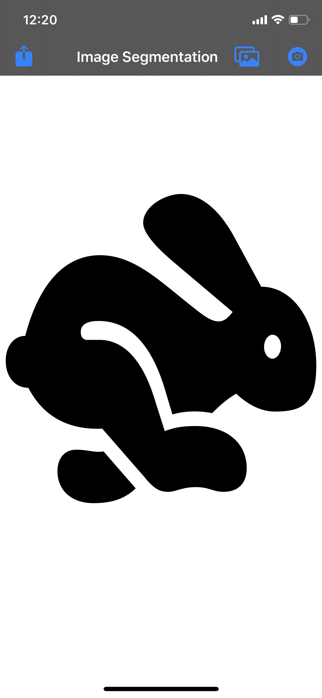
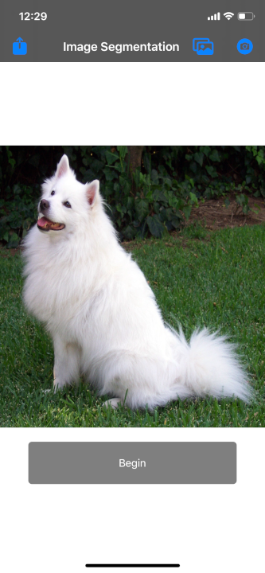
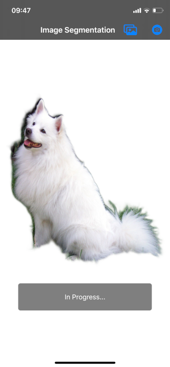
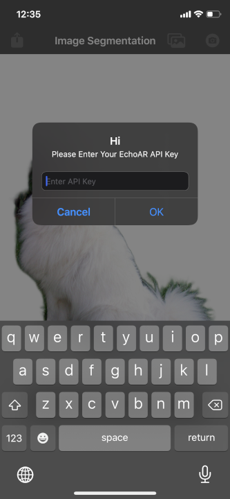
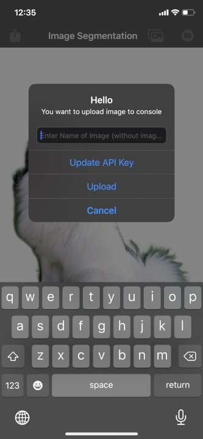
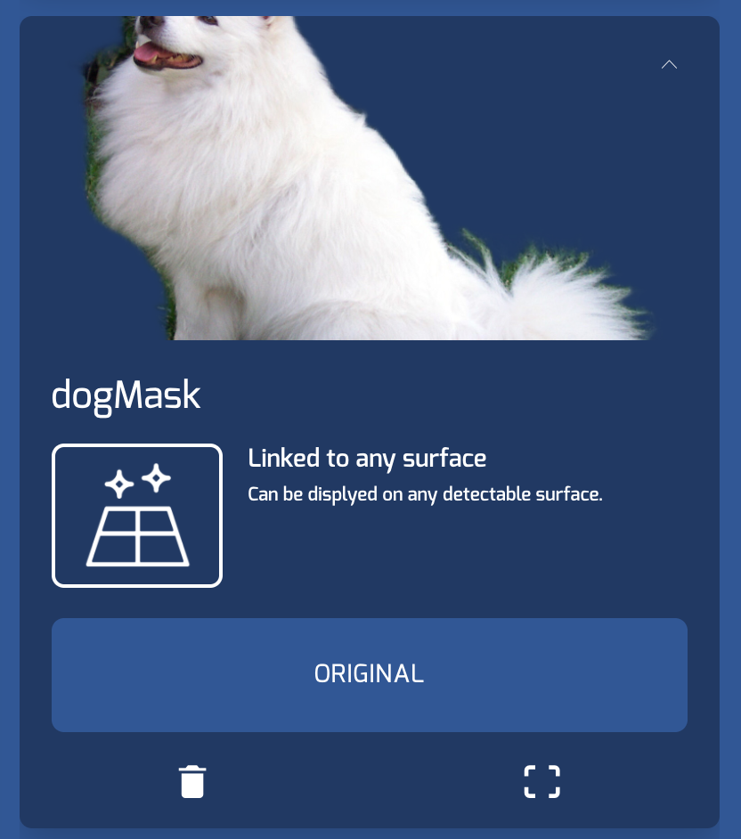

# echoAR Object Segmentation 

Foreground extraction iOS Applciation. The app let's the user to select an image, extract foreground and upload the image object to the echoAR console.

## Register
If you don't have an echoAR API key yet, make sure to register for FREE at [echoAR](https://console.echoar.xyz/#/auth/register).

## Installation
- Clone the project from the github repository.
- Open up Xcode and select 'open an existing project'.
- Connect an IOS Device and build the project.

## Usage
- Open the application and you will see the home screen.
  <br> <br> 
- There are two options at the top-right corner of the navigation bar.
  - Photogallery: If you want to choose image from photo-gallery.
  - Camera: If you choose to take an new image.

- After choosing an image either from camera or photogallery, click "Begin Button" to start foreground extraction
    <br> <br>  

- Original Image will be processed to extract the foreground.
    <br> <br>  

- If you wish to upload image to the echoAR console, click on the upload button at the top left corner.
  - There will be a prompt to enter API key.
  <br><br>  
  - After entering API-Key, enter the name of the image and click on Upload.
     <br><br>  
  - Image will be available at the console and can be used for different projects.
     <br><br>   


## Creating APIRequest

If you want to add image upload functionality to your custom application, add `APIRequest.swift` and `Media.swift` to your project folder.

- To make an http-post request create an `APIRequest` object: 
    <br>
    ```
    let postRequest = APIRequest()
    ```
    
- To send the post request use `send()` instance method of `APIRequest`, which accepts these parameters:
   - `image` (type: UIimage): The UIImage you need to upload to the console
   - `imageName` (type: String): The name of the image
   - `echoARApiKey` (type: String) : Your API key
   - `completion` (type: closure): Escaping Closure which is passed as an arguement to the function but is called after function returns. It return Result type that has two cases: success and failure, where the success case will return a string and the failure case will be some sort of API Error.
```
let postRequest = APIRequest()
postRequest.send(imageToPost: UIimage,fileName: String, APIKey: String, completion: {
    result in switch result {
    case .success(_):
        print("Success Uploading")
    case .failure(.incorrectKeyProblem):
        self.createErrorAlert("Incorrect Key", "Please Check key and Try again")
        print("Incorrect Key")
    case .failure(let error):
        print("Error Occurred \(error)")
    
    }
})
```

- Post Request performs `multipart/form-data` httpRequest, where key-value pair are seperated with the randomnly generated boundary string. 
- Post Request only works for `target_type = 2`, `hologram_type = 1`  and image is sent as `file_image_hologram`. 

### APIErrors:
- Closure which is passed as an `send(_)` request return `.success` or `.failure`, where `.failure` is type of `APIError`:
    - responseProblem: Problem with the API Response
    - decodingProblem: Error decoding API Response data
    - incorrectKeyProblem: Incorrect API Key
    
   
## Learn more
Refer to our [documentation](https://docs.echoar.xyz/unity/) to learn more about how to use Unity, AR Foundation, and echoAR.

## Support
Feel free to reach out at [support@echoAR.xyz](mailto:support@echoAR.xyz) or join our [support channel on Slack](https://join.slack.com/t/echoar/shared_invite/enQtNTg4NjI5NjM3OTc1LWU1M2M2MTNlNTM3NGY1YTUxYmY3ZDNjNTc3YjA5M2QyNGZiOTgzMjVmZWZmZmFjNGJjYTcxZjhhNzk3YjNhNjE). 

## Screenshots

